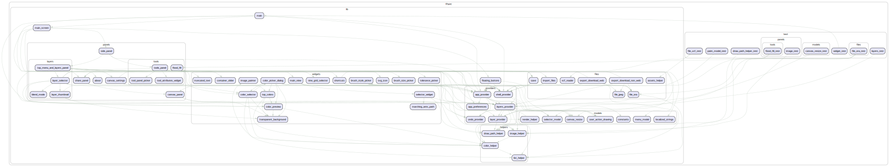

# fPaint

## Flutter Raster Drawing App

A feature-rich drawing and painting application built with Flutter that allows users to create digital artwork on any platform – iOS, Android, macOS, Windows, Linux, and Web – from a single code base.

## Features

- Free-hand drawing and sketching with multiple brush sizes and styles
- Advanced layers functionality for organized artwork management
- Enhanced selection tools including Magic Wand selection for precise edits
- Powerful color picker with a customizable auto palette
- Undo/Redo functionality for effortless corrections
- Save drawings directly to your device or Download on Web
- Responsive design optimized for different screen sizes
- One code base for all platforms ensuring consistent performance and updates
- Open and work with OpenRaster ORA file format

This app is 100% free with no ads or nagging. We invite all Flutter enthusiasts to contribute and support the project.

## Getting Started

### Prerequisites

- Flutter SDK (3.2 or higher)
- Dart SDK
- Edit and build on MacOS,Windows, or Linux
- IDE VS Code or Android Studio
- iOS Simulator / Android Emulator

### Installation

1. Clone the repository

    ```bash
    git clone https://github.com/vteam-com/fPaint.git
    ```

2. Navigate to the project directory

    ```bash
    cd fPaint
    ```

3. Install dependencies

    ```bash
    flutter pub get
    ```

4. Run the app

    ```bash
    flutter run
    ```

## Usage

1. Launch the app
2. Choose your preferred brush size and color
3. Start drawing on the canvas
4. Use the SidePanel to:
   - Change colors
   - Adjust brush size
   - Use advanced selection tools such as Magic Wand selection
   - Manage layers efficiently
   - Undo/Redo actions
   - Clear the canvas
   - Save your artwork

## License

This project is licensed under the **MIT** License.

## Screenshots


## The OpenRaster (ORA) file format

```xml
<?xml version="1.0" encoding="UTF-8"?>
<image xmlns:drawpile="http://paint.vteam.com/"
    xmlns:mypaint="http://mypaint.org/ns/openraster" w="800" h="800" version="0.0.6" xres="72" yres="72" drawpile:framerate="24">
    <stack>
        <layer src="data/layer-0103.png" x="134" y="91" opacity="1.0000" name="birds"/>
        <layer src="data/layer-0100.png" y="268" opacity="1.0000" name="Cloud"/>
        <layer src="data/layer-0101.png" y="579" opacity="1.0000" name="Dirt"/>
        <layer src="data/layer-0102.png" opacity="1.0000" name="sky"/>
        <layer name="Background" src="data/background.png" mypaint:background-tile="data/background-tile.png"/>
    </stack>
</image>
```

## Graph Dependencies



*How to generate the above graph. Run these commands on macOS .*

```bash
dart pub global activate lakos
brew install graphviz
./tool/graph.sh
```

Please contribute and report issues on the GitHub repository.
<https://github.com/vteam-com/fPaint>
